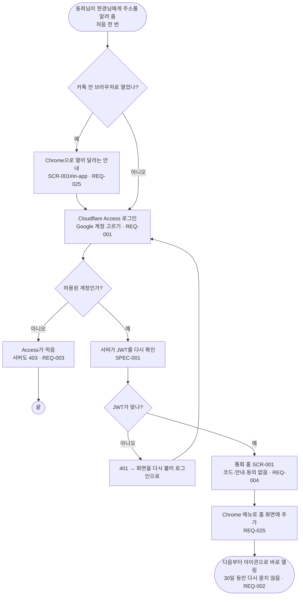

# FL-001 처음 들어오기

Serves: REQ-001, REQ-002, REQ-003, REQ-004, REQ-025, REQ-058
Screens: SCR-001, Cloudflare Access 로그인 화면(바깥)

처음 한 번은 동희님이 주소를 알려 주고 같이 홈 화면에 추가해요. 그다음부터는 아이콘을 누르면 바로 통화 홈이에요.

```mermaid
flowchart TD
  A(["동희님이 현경님에게 주소를 알려 줌<br/>처음 한 번"]) --> B{"카톡 안 브라우저로 열었나?"}
  B -->|예| B1["Chrome으로 열어 달라는 안내<br/>SCR-001#in-app · REQ-025"] --> C
  B -->|아니오| C["Cloudflare Access 로그인<br/>Google 계정 고르기 · REQ-001"]
  C --> D{"허용된 계정인가?"}
  D -->|아니오| D1["Access가 막음<br/>서버도 403 · REQ-003"] --> Z(["끝"])
  D -->|예| E["서버가 JWT를 다시 확인<br/>SPEC-001"]
  E --> F{"JWT가 맞나?"}
  F -->|아니오| F1["401 → 화면을 다시 불러 로그인으로"] --> C
  F -->|예| G["통화 홈 SCR-001<br/>코드·안내·동의 없음 · REQ-004"]
  G --> H["Chrome 메뉴로 홈 화면에 추가<br/>REQ-025"]
  H --> I(["다음부터 아이콘으로 바로 열림<br/>30일 동안 다시 묻지 않음 · REQ-002"])
```
