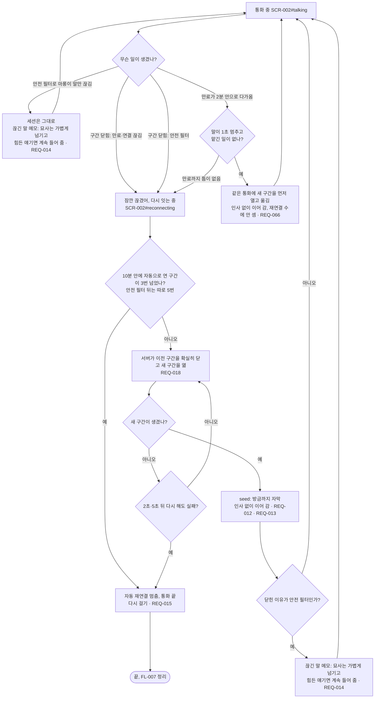

# FL-004 끊김과 자동 재연결

Serves: REQ-012, REQ-013, REQ-014, REQ-015, REQ-018, REQ-061, REQ-066
Screens: SCR-002

```mermaid
flowchart TD
  A["통화 중 SCR-002#talking"] --> B{"무슨 일이 생겼나?"}
  B -->|"구간 닫힘: 만료·연결 끊김"| C["잠깐 끊겼어, 다시 잇는 중<br/>SCR-002#reconnecting"]
  B -->|"구간 닫힘: 안전 필터"| C
  B -->|"안전 필터로 마롱이 말만 끊김"| B2["세션은 그대로<br/>끊긴 말 메모: 묘사는 가볍게 넘기고<br/>힘든 얘기면 계속 들어 줌 · REQ-014"] --> A
  B -->|"만료가 2분 안으로 다가옴"| R1{"말이 1초 멈추고<br/>맡긴 일이 없나?"}
  R1 -->|예| R2["같은 통화에 새 구간을 먼저 열고 옮김<br/>인사 없이 이어 감, 재연결 수에 안 셈 · REQ-066"] --> A
  R1 -->|"만료까지 틈이 없음"| C
  C --> D{"10분 안에 자동으로 연 구간이 3번 넘었나?<br/>안전 필터 뒤는 따로 5번"}
  D -->|예| D1["자동 재연결 멈춤, 통화 끝<br/>다시 걸기 · REQ-015"] --> Z(["끝, FL-007 정리"])
  D -->|아니오| E["서버가 이전 구간을 확실히 닫고 새 구간을 엶<br/>REQ-018"]
  E --> F{"새 구간이 생겼나?"}
  F -->|"아니오"| F1{"2초·5초 뒤 다시 해도 실패?"}
  F1 -->|예| D1
  F1 -->|아니오| E
  F -->|예| G["seed: 방금까지 자막<br/>인사 없이 이어 감 · REQ-012 · REQ-013"]
  G --> H{"닫힌 이유가 안전 필터인가?"}
  H -->|예| H1["끊긴 말 메모: 묘사는 가볍게 넘기고<br/>힘든 얘기면 계속 들어 줌 · REQ-014"] --> A
  H -->|아니오| A
```

다시 잇는 동안 마롱이 얼굴은 걱정하는 얼굴(13)이에요(REQ-061, SPEC-029).
