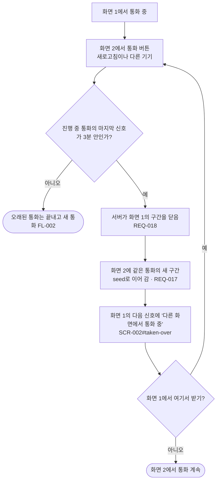

# FL-006 다른 화면에서 이어 받기

Serves: REQ-017, REQ-018
Screens: SCR-001(화면 2의 통화 버튼·여기서 이어 받기), SCR-002

```mermaid
flowchart TD
  A["화면 1에서 통화 중"] --> B["화면 2에서 통화 버튼<br/>새로고침이나 다른 기기"]
  B --> C{"진행 중 통화의 마지막 신호가 3분 안인가?"}
  C -->|아니오| C1(["오래된 통화는 끝내고 새 통화 FL-002"])
  C -->|예| D["서버가 화면 1의 구간을 닫음<br/>REQ-018"]
  D --> E["화면 2에 같은 통화의 새 구간<br/>seed로 이어 감 · REQ-017"]
  E --> F["화면 1의 다음 신호에 '다른 화면에서 통화 중'<br/>SCR-002#taken-over"]
  F --> G{"화면 1에서 여기서 받기?"}
  G -->|예| B
  G -->|아니오| Z(["화면 2에서 통화 계속"])
```
