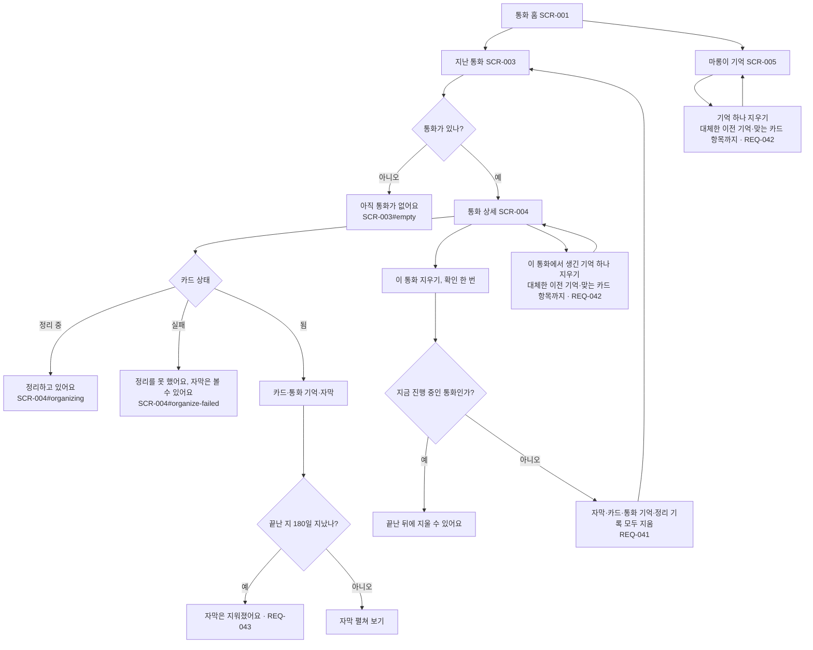

# FL-008 지난 통화와 기억 보기·지우기

Serves: REQ-040, REQ-041, REQ-042, REQ-043
Screens: SCR-001, SCR-003, SCR-004, SCR-005

```mermaid
flowchart TD
  A["통화 홈 SCR-001"] --> B["지난 통화 SCR-003"]
  B --> B1{"통화가 있나?"}
  B1 -->|아니오| B2["아직 통화가 없어요<br/>SCR-003#empty"]
  B1 -->|예| C["통화 상세 SCR-004"]
  C --> D{"카드 상태"}
  D -->|"정리 중"| D1["정리하고 있어요<br/>SCR-004#organizing"]
  D -->|"실패"| D2["정리를 못 했어요, 자막은 볼 수 있어요<br/>SCR-004#organize-failed"]
  D -->|"됨"| D3["카드·통화 기억·자막"]
  D3 --> E{"끝난 지 180일 지났나?"}
  E -->|예| E1["자막은 지워졌어요 · REQ-043"]
  E -->|아니오| E2["자막 펼쳐 보기"]
  C --> F["이 통화 지우기, 확인 한 번"]
  F --> G{"지금 진행 중인 통화인가?"}
  G -->|예| G1["끝난 뒤에 지울 수 있어요"]
  G -->|아니오| H["자막·카드·통화 기억·정리 기록 모두 지움<br/>REQ-041"] --> B
  C --> M2["이 통화에서 생긴 기억 하나 지우기<br/>대체한 이전 기억·맞는 카드 항목까지 · REQ-042"] --> C
  A --> M["마롱이 기억 SCR-005"]
  M --> M1["기억 하나 지우기<br/>대체한 이전 기억·맞는 카드 항목까지 · REQ-042"] --> M
```
