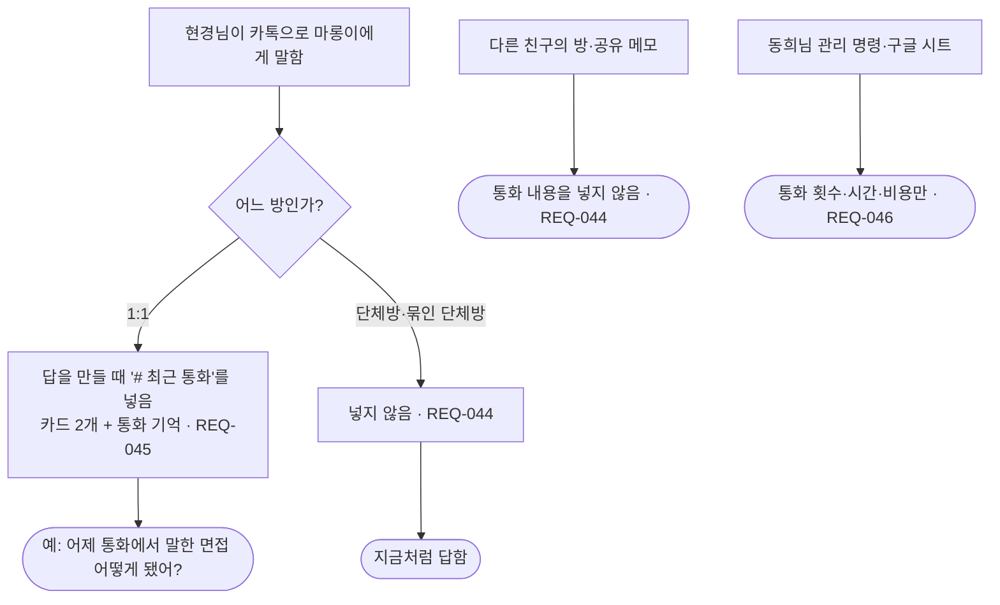

# FL-010 카톡 마롱이가 통화를 이어 알기

Serves: REQ-044, REQ-045, REQ-046
Screens: 없음(카톡)

```mermaid
flowchart TD
  A["현경님이 카톡으로 마롱이에게 말함"] --> B{"어느 방인가?"}
  B -->|"1:1"| C["답을 만들 때 '# 최근 통화'를 넣음<br/>카드 2개 + 통화 기억 · REQ-045"]
  B -->|"단체방·묶인 단체방"| D["넣지 않음 · REQ-044"]
  C --> E(["예: 어제 통화에서 말한 면접 어떻게 됐어?"])
  D --> F(["지금처럼 답함"])
  G["다른 친구의 방·공유 메모"] --> H(["통화 내용을 넣지 않음 · REQ-044"])
  I["동희님 관리 명령·구글 시트"] --> J(["통화 횟수·시간·비용만 · REQ-046"])
```
