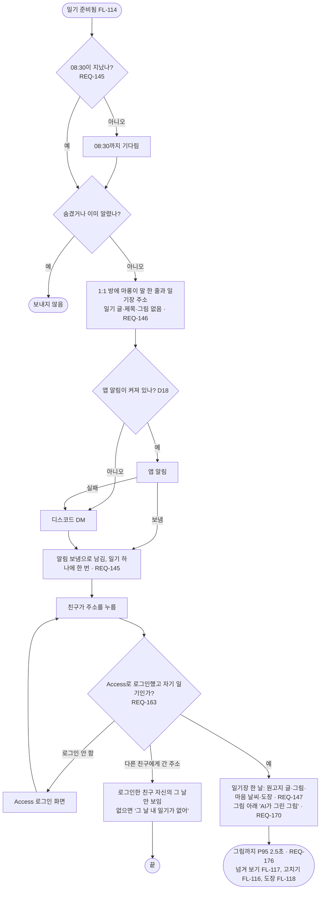

# FL-115 아침에 받아 보기

Serves: REQ-145, REQ-146, REQ-147, REQ-163, REQ-170, REQ-176

알림은 D18 길(앱 알림이 켜져 있으면 앱으로, 아니면 디스코드 DM)을 그대로 따라요. 알림에는 일기 글이 없어서 잠금 화면에 보여도 괜찮아요.

```mermaid
flowchart TD
  A(["일기 준비됨 FL-114"]) --> B{"08:30이 지났나?<br/>REQ-145"}
  B -->|아니오| B1["08:30까지 기다림"] --> C
  B -->|예| C{"숨겼거나 이미 알렸나?"}
  C -->|예| Z(["보내지 않음"])
  C -->|아니오| D["1:1 방에 마롱이 말 한 줄과 일기장 주소<br/>일기 글·제목·그림 없음 · REQ-146"]
  D --> E{"앱 알림이 켜져 있나? D18"}
  E -->|예| F["앱 알림"]
  E -->|아니오| G["디스코드 DM"]
  F -->|실패| G
  F -->|보냄| H["알림 보냄으로 남김, 일기 하나에 한 번 · REQ-145"]
  G --> H
  H --> I["친구가 주소를 누름"]
  I --> J{"Access로 로그인했고 자기 일기인가?<br/>REQ-163"}
  J -->|"로그인 안 함"| J1["Access 로그인 화면"] --> I
  J -->|"다른 친구에게 간 주소"| J2["로그인한 친구 자신의 그 날만 보임<br/>없으면 '그 날 내 일기가 없어'"] --> Z2(["끝"])
  J -->|예| K["일기장 한 날: 원고지 글·그림·마음 날씨·도장 · REQ-147<br/>그림 아래 'AI가 그린 그림' · REQ-170"]
  K --> L(["그림까지 P95 2.5초 · REQ-176<br/>넘겨 보기 FL-117, 고치기 FL-116, 도장 FL-118"])
```
