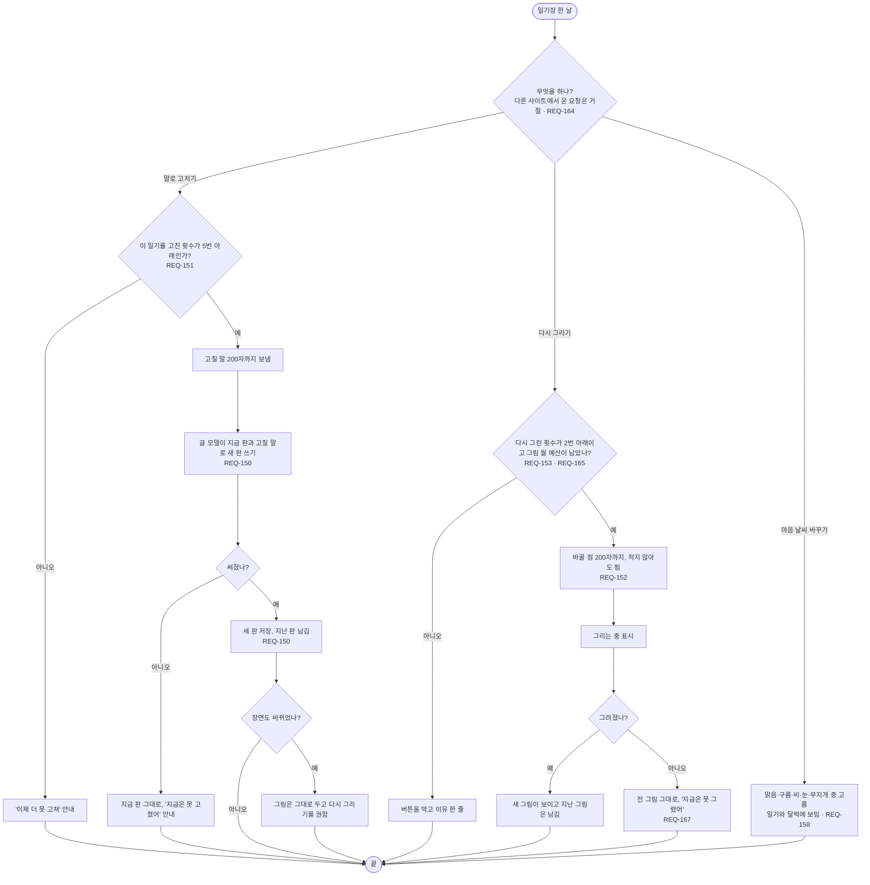

# FL-116 고치기와 다시 그리기

Serves: REQ-150, REQ-151, REQ-152, REQ-153, REQ-158, REQ-164, REQ-165, REQ-167

고치면 새 판이 생기고 지난 판은 남아요(README '기록은 지워지지 않아요'). 실패한 고치기·다시 그리기는 횟수에 세지 않아요.

```mermaid
flowchart TD
  A(["일기장 한 날"]) --> B{"무엇을 하나?<br/>다른 사이트에서 온 요청은 거절 · REQ-164"}
  B -->|"말로 고치기"| C{"이 일기를 고친 횟수가 5번 아래인가?<br/>REQ-151"}
  C -->|아니오| C1["'이제 더 못 고쳐' 안내"] --> Z(["끝"])
  C -->|예| D["고칠 말 200자까지 보냄"]
  D --> E["글 모델이 지금 판과 고칠 말로 새 판 쓰기<br/>REQ-150"]
  E --> F{"써졌나?"}
  F -->|아니오| F1["지금 판 그대로, '지금은 못 고쳤어' 안내"] --> Z
  F -->|예| G["새 판 저장, 지난 판 남김<br/>REQ-150"]
  G --> H{"장면도 바뀌었나?"}
  H -->|아니오| Z
  H -->|예| H1["그림은 그대로 두고 다시 그리기를 권함"] --> Z
  B -->|"다시 그리기"| I{"다시 그린 횟수가 2번 아래이고 그림 월 예산이 남았나?<br/>REQ-153 · REQ-165"}
  I -->|아니오| I1["버튼을 막고 이유 한 줄"] --> Z
  I -->|예| J["바꿀 점 200자까지, 적지 않아도 됨<br/>REQ-152"]
  J --> K["그리는 중 표시"]
  K --> L{"그려졌나?"}
  L -->|예| M["새 그림이 보이고 지난 그림은 남김"] --> Z
  L -->|아니오| N["전 그림 그대로, '지금은 못 그렸어'<br/>REQ-167"] --> Z
  B -->|"마음 날씨 바꾸기"| O["맑음·구름·비·눈·무지개 중 고름<br/>일기와 달력에 보임 · REQ-158"] --> Z
```
