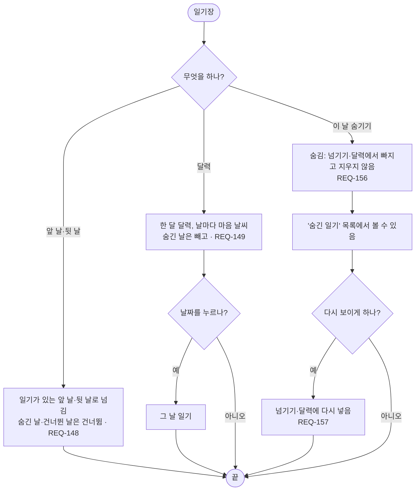

# FL-117 넘겨 보기, 달력과 숨기기

Serves: REQ-148, REQ-149, REQ-156, REQ-157

숨기기는 지우기가 아니에요. 숨긴 일기는 '숨긴 일기'에서 다시 보이게 할 수 있어요.

```mermaid
flowchart TD
  A(["일기장"]) --> B{"무엇을 하나?"}
  B -->|"앞 날·뒷 날"| C["일기가 있는 앞 날·뒷 날로 넘김<br/>숨긴 날·건너뛴 날은 건너뜀 · REQ-148"] --> Z(["끝"])
  B -->|"달력"| D["한 달 달력, 날마다 마음 날씨<br/>숨긴 날은 빼고 · REQ-149"]
  D --> E{"날짜를 누르나?"}
  E -->|예| F["그 날 일기"] --> Z
  E -->|아니오| Z
  B -->|"이 날 숨기기"| G["숨김: 넘기기·달력에서 빠지고 지우지 않음<br/>REQ-156"]
  G --> H["'숨긴 일기' 목록에서 볼 수 있음"]
  H --> I{"다시 보이게 하나?"}
  I -->|예| J["넘기기·달력에 다시 넣음<br/>REQ-157"] --> Z
  I -->|아니오| Z
```
