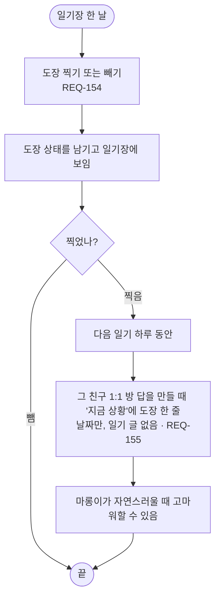

# FL-118 도장과 마롱이가 알기

Serves: REQ-154, REQ-155
Screens: SCR-113(마롱이가 아는 것은 1:1 방 답이라 화면 없음)

도장은 친구가 마롱이 일기에 찍어 주는 표시예요(D22의 '도장 찍어 주는 놀이'). 마롱이가 도장 얘기를 꺼낼지는 대화 흐름에 맡겨요(친구 먼저).

```mermaid
flowchart TD
  A(["일기장 한 날"]) --> B["도장 찍기 또는 빼기<br/>REQ-154"]
  B --> C["도장 상태를 남기고 일기장에 보임"]
  C --> D{"찍었나?"}
  D -->|뺌| Z(["끝"])
  D -->|찍음| E["다음 일기 하루 동안"]
  E --> F["그 친구 1:1 방 답을 만들 때 '지금 상황'에 도장 한 줄<br/>날짜만, 일기 글 없음 · REQ-155"]
  F --> G["마롱이가 자연스러울 때 고마워할 수 있음"] --> Z
```
