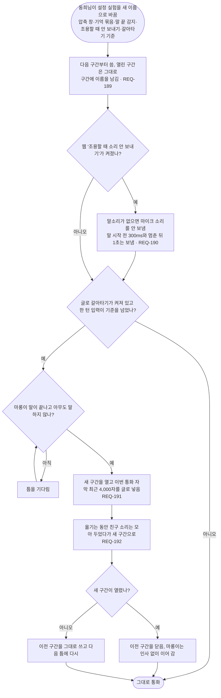

# FL-122 설정 실험과 글로 갈아타기

Serves: REQ-189, REQ-190, REQ-191, REQ-192
Screens: 없음(관리 명령, 친구에게 보이지 않음)

목소리(Sulafat)와 지시문의 성격은 설정 실험으로 바꾸지 않아요. 구간과 통화 사용량에 설정 실험 이름이 남아 숫자로 비교해요.

```mermaid
flowchart TD
  A(["동희님이 설정 실험을 새 이름으로 바꿈<br/>압축 창·기억 묶음·말 끝 감지·조용할 때 안 보내기·갈아타기 기준"]) --> B["다음 구간부터 씀, 열린 구간은 그대로<br/>구간에 이름을 남김 · REQ-189"]
  B --> C{"웹 '조용할 때 소리 안 보내기'가 켜졌나?"}
  C -->|예| C1["말소리가 없으면 마이크 소리를 안 보냄<br/>말 시작 전 300ms와 멈춘 뒤 1초는 보냄 · REQ-190"] --> D
  C -->|아니오| D{"글로 갈아타기가 켜져 있고 한 턴 입력이 기준을 넘었나?"}
  D -->|아니오| Z(["그대로 통화"])
  D -->|예| E{"마롱이 말이 끝나고 아무도 말하지 않나?"}
  E -->|아직| E1["틈을 기다림"] --> E
  E -->|예| F["새 구간을 열고 이번 통화 자막 최근 4,000자를 글로 넣음<br/>REQ-191"]
  F --> G["옮기는 동안 친구 소리는 모아 두었다가 새 구간으로<br/>REQ-192"]
  G --> H{"새 구간이 열렸나?"}
  H -->|예| I["이전 구간을 닫음, 마롱이는 인사 없이 이어 감"] --> Z
  H -->|아니오| J["이전 구간을 그대로 쓰고 다음 틈에 다시"] --> Z
```
