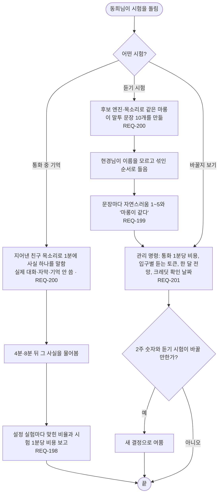

# FL-123 통화 중 기억 시험, 듣기 시험과 바꿀지 보기

Serves: REQ-198, REQ-199, REQ-200, REQ-201

시험에는 실제 대화·자막·기억을 쓰지 않아요. 엔진과 목소리를 바꾸는 일은 이번 범위가 아니라 숫자를 보고 새 결정으로 여쭤요.

```mermaid
flowchart TD
  A(["동희님이 시험을 돌림"]) --> B{"어떤 시험?"}
  B -->|"통화 중 기억"| C["지어낸 친구 목소리로 1분에 사실 하나를 말함<br/>실제 대화·자막·기억 안 씀 · REQ-200"]
  C --> D["4분·8분 뒤 그 사실을 물어봄"]
  D --> E["설정 실험마다 맞힌 비율과 시험 1분당 비용 보고<br/>REQ-198"] --> Z(["끝"])
  B -->|"듣기 시험"| F["후보 엔진·목소리로 같은 마롱이 말투 문장 10개를 만듦<br/>REQ-200"]
  F --> G["현경님이 이름을 모르고 섞인 순서로 들음"]
  G --> H["문장마다 자연스러움 1~5와 '마롱이 같다'<br/>REQ-199"] --> I
  B -->|"바꿀지 보기"| I["관리 명령: 통화 1분당 비용, 입구별 듣는 토큰, 한 달 전망, 크레딧 확인 날짜<br/>REQ-201"]
  I --> J{"2주 숫자와 듣기 시험이 바꿀 만한가?"}
  J -->|예| K["새 결정으로 여쭘"] --> Z
  J -->|아니오| Z
```
