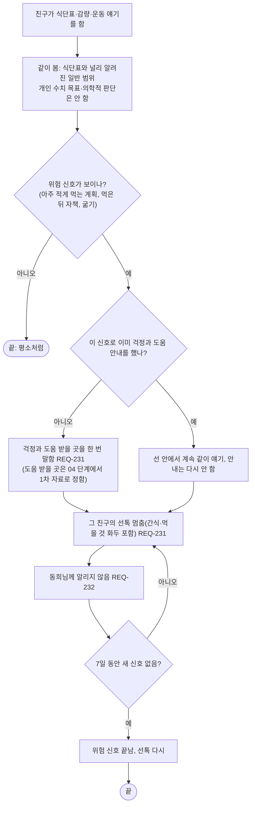

# FL-132 몸·식단 얘기를 같이 보다가 위험 신호를 만남

Serves: REQ-231, REQ-232
Screens: 없음(대화·통화)
Context: CTX-012, CTX-010

```mermaid
flowchart TD
  A["친구가 식단표·감량·운동 얘기를 함"] --> B["같이 봄: 식단표와 널리 알려진 일반 범위<br/>개인 수치 목표·의학적 판단은 안 함"]
  B --> C{"위험 신호가 보이나?<br/>(아주 적게 먹는 계획, 먹은 뒤 자책, 굶기)"}
  C -->|아니오| Y0(["끝: 평소처럼"])
  C -->|예| D{"이 신호로 이미 걱정과 도움 안내를 했나?"}
  D -->|예| E["선 안에서 계속 같이 얘기, 안내는 다시 안 함"]
  D -->|아니오| F["걱정과 도움 받을 곳을 한 번 말함 REQ-231<br/>(도움 받을 곳은 04 단계에서 1차 자료로 정함)"]
  F --> G["그 친구의 선톡 멈춤(간식·먹을 것 화두 포함) REQ-231"]
  E --> G
  G --> H["동희님께 알리지 않음 REQ-232"]
  H --> I{"7일 동안 새 신호 없음?"}
  I -->|예| J["위험 신호 끝남, 선톡 다시"]
  I -->|아니오| G
  J --> Y(["끝"])
```

- '너무 굶거나 무리하는 계획이면 솔직하게 말하고 무리 없는 쪽을 같이 잡아 줘'는 지금 통화 지시문 그대로예요.
