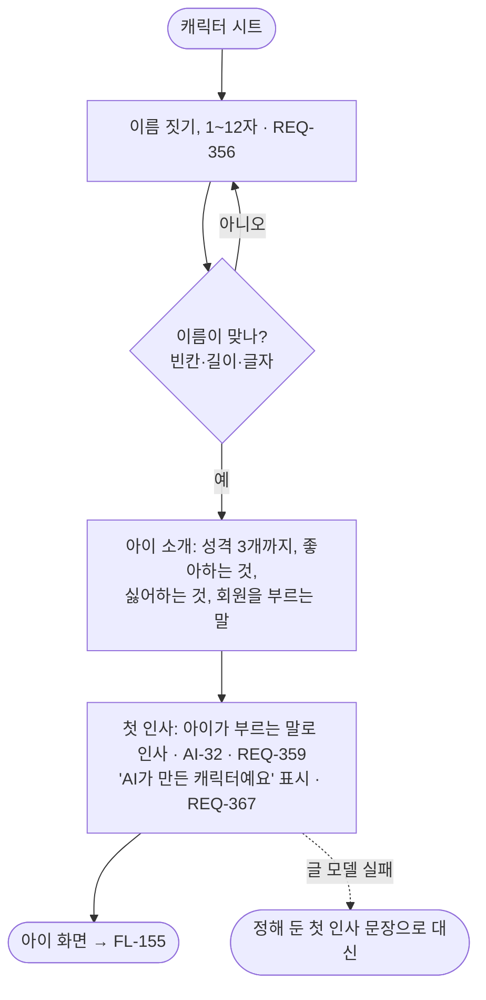

# FL-154 이름을 짓고 첫 인사 받기

Serves: REQ-356, REQ-359, REQ-367, REQ-333
Screens: 07 단계 뒤에 SCR를 채워요
Context: CTX-022

```mermaid
flowchart TD
  A(["캐릭터 시트"]) --> B["이름 짓기, 1~12자 · REQ-356"]
  B --> B1{"이름이 맞나?<br/>빈칸·길이·글자"}
  B1 -->|"아니오"| B
  B1 -->|"예"| C["아이 소개: 성격 3개까지, 좋아하는 것,<br/>싫어하는 것, 회원을 부르는 말"]
  C --> E["첫 인사: 아이가 부르는 말로 인사 · AI-32 · REQ-359<br/>'AI가 만든 캐릭터예요' 표시 · REQ-367"]
  E --> F(["아이 화면 → FL-155"])
  E -.->|"글 모델 실패"| E1(["정해 둔 첫 인사 문장으로 대신"])
```

- 추억 모드로 만든 아이의 첫 인사는 '놀러 왔어' 결이에요(04 단계 3.9).
