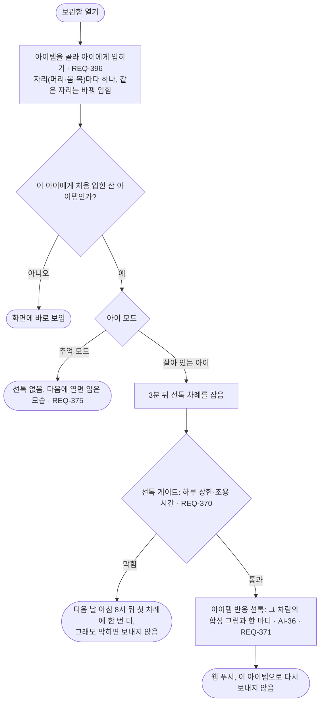

# FL-159 아이에게 입히고 아이템 반응 선톡 받기

Serves: REQ-396, REQ-371, REQ-370, REQ-375
Screens: SCR-147, SCR-152
Context: CTX-023, CTX-009

```mermaid
flowchart TD
  A(["보관함 열기"]) --> B["아이템을 골라 아이에게 입히기 · REQ-396<br/>자리(머리·몸·목)마다 하나, 같은 자리는 바꿔 입힘"]
  B --> C{"이 아이에게 처음 입힌 산 아이템인가?"}
  C -->|"아니오"| Z(["화면에 바로 보임"])
  C -->|"예"| D{"아이 모드"}
  D -->|"추억 모드"| Z1(["선톡 없음, 다음에 열면 입은 모습 · REQ-375"])
  D -->|"살아 있는 아이"| E["3분 뒤 선톡 차례를 잡음"]
  E --> F{"선톡 게이트: 하루 상한·조용 시간 · REQ-370"}
  F -->|"막힘"| F1(["다음 날 아침 8시 뒤 첫 차례에 한 번 더,<br/>그래도 막히면 보내지 않음"])
  F -->|"통과"| G["아이템 반응 선톡: 그 차림의 합성 그림과 한 마디 · AI-36 · REQ-371"]
  G --> H(["웹 푸시, 이 아이템으로 다시 보내지 않음"])
```

- 무료 기본 아이템은 '산 아이템'이 아니라서 반응 선톡이 없어요(새 제안: 가입하자마자 선톡이 몰리지 않게).
