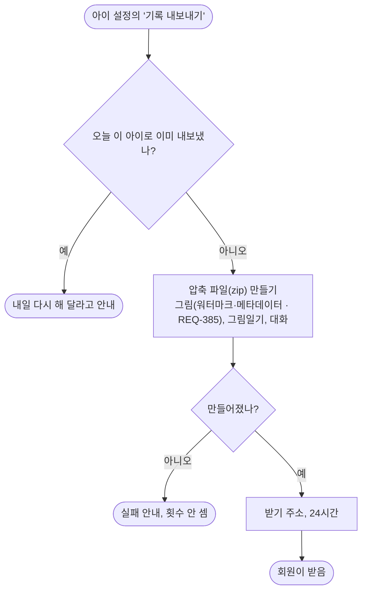

# FL-163 기록 내보내기

Serves: REQ-384, REQ-385
Screens: 07 단계 뒤에 SCR를 채워요
Context: CTX-022

```mermaid
flowchart TD
  A(["아이 설정의 '기록 내보내기'"]) --> B{"오늘 이 아이로 이미 내보냈나?"}
  B -->|"예"| B1(["내일 다시 해 달라고 안내"])
  B -->|"아니오"| C["압축 파일(zip) 만들기<br/>그림(워터마크·메타데이터 · REQ-385), 그림일기, 대화"]
  C --> C1{"만들어졌나?"}
  C1 -->|"아니오"| C2(["실패 안내, 횟수 안 셈"])
  C1 -->|"예"| D["받기 주소, 24시간"]
  D --> E(["회원이 받음"])
```

- 보관한 아이도 내보낼 수 있어요.
