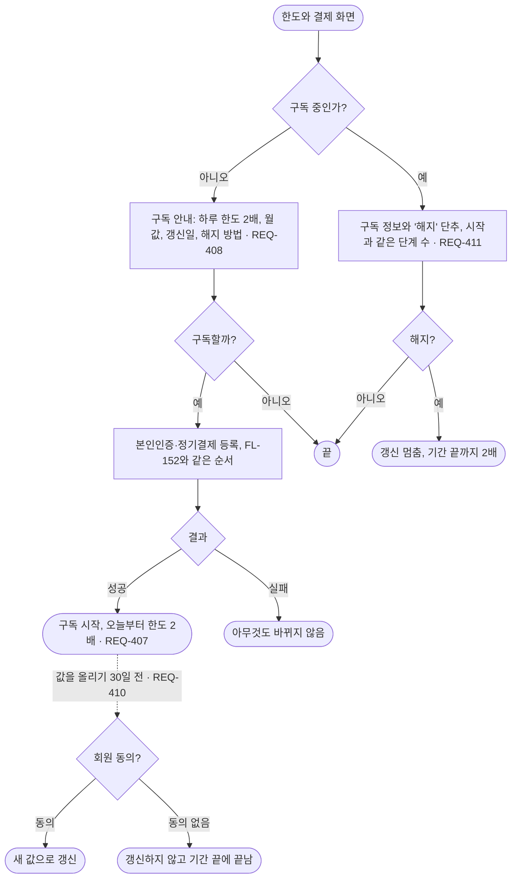

# FL-164 구독을 시작하고 해지하기

Serves: REQ-407, REQ-408, REQ-410, REQ-411, REQ-332
Screens: SCR-160, SCR-162(정기결제 등록 창은 결제 대행이 그림)
Context: CTX-024

```mermaid
flowchart TD
  A(["한도와 결제 화면"]) --> B{"구독 중인가?"}
  B -->|"아니오"| C["구독 안내: 하루 한도 2배, 월 값, 갱신일, 해지 방법 · REQ-408"]
  C --> D{"구독할까?"}
  D -->|"예"| E["본인인증·정기결제 등록, FL-152와 같은 순서"]
  E --> F{"결과"}
  F -->|"성공"| G(["구독 시작, 오늘부터 한도 2배 · REQ-407"])
  F -->|"실패"| H(["아무것도 바뀌지 않음"])
  D -->|"아니오"| Z(["끝"])
  B -->|"예"| I["구독 정보와 '해지' 단추, 시작과 같은 단계 수 · REQ-411"]
  I --> J{"해지?"}
  J -->|"예"| K(["갱신 멈춤, 기간 끝까지 2배"])
  J -->|"아니오"| Z
  G -.->|"값을 올리기 30일 전 · REQ-410"| L{"회원 동의?"}
  L -->|"동의"| M(["새 값으로 갱신"])
  L -->|"동의 없음"| N(["갱신하지 않고 기간 끝에 끝남"])
```
