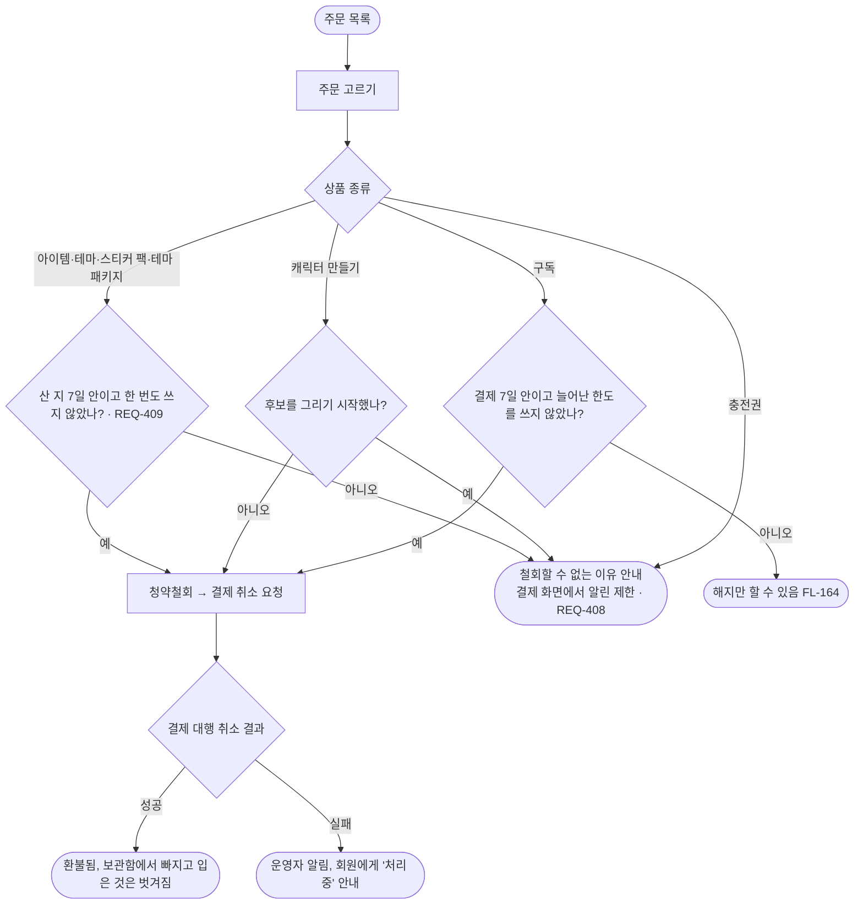

# FL-165 청약철회하고 환불받기

Serves: REQ-409, REQ-408, REQ-352
Screens: SCR-161
Context: CTX-024

```mermaid
flowchart TD
  A(["주문 목록"]) --> B["주문 고르기"]
  B --> C{"상품 종류"}
  C -->|"아이템·테마·스티커 팩·테마 패키지"| D{"산 지 7일 안이고 한 번도 쓰지 않았나? · REQ-409"}
  D -->|"예"| E["청약철회 → 결제 취소 요청"]
  D -->|"아니오"| F(["철회할 수 없는 이유 안내<br/>결제 화면에서 알린 제한 · REQ-408"])
  C -->|"캐릭터 만들기"| G{"후보를 그리기 시작했나?"}
  G -->|"아니오"| E
  G -->|"예"| F
  C -->|"충전권"| F
  C -->|"구독"| H{"결제 7일 안이고 늘어난 한도를 쓰지 않았나?"}
  H -->|"예"| E
  H -->|"아니오"| F2(["해지만 할 수 있음 FL-164"])
  E --> I{"결제 대행 취소 결과"}
  I -->|"성공"| J(["환불됨, 보관함에서 빠지고 입은 것은 벗겨짐"])
  I -->|"실패"| K(["운영자 알림, 회원에게 '처리 중' 안내"])
```

- 결제 뒤 그림 후보를 30분 안에 못 만든 자동 취소(REQ-352)는 FL-153이에요.
- 구독 환불 조건은 출시 전 법 확인이 필요해요(04 단계 7절).
