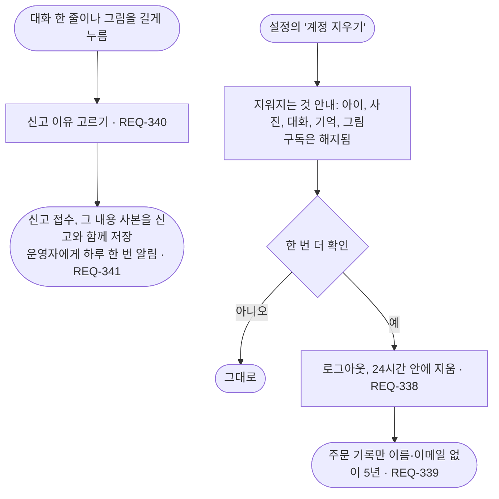

# FL-166 신고하고 계정 지우기

Serves: REQ-340, REQ-341, REQ-338, REQ-339, REQ-336
Screens: 07 단계 뒤에 SCR를 채워요
Context: CTX-025

```mermaid
flowchart TD
  A(["대화 한 줄이나 그림을 길게 누름"]) --> B["신고 이유 고르기 · REQ-340"]
  B --> C(["신고 접수, 그 내용 사본을 신고와 함께 저장<br/>운영자에게 하루 한 번 알림 · REQ-341"])
  D(["설정의 '계정 지우기'"]) --> E["지워지는 것 안내: 아이, 사진, 대화, 기억, 그림<br/>구독은 해지됨"]
  E --> F{"한 번 더 확인"}
  F -->|"아니오"| Z(["그대로"])
  F -->|"예"| G["로그아웃, 24시간 안에 지움 · REQ-338"]
  G --> H(["주문 기록만 이름·이메일 없이 5년 · REQ-339"])
```

- 국외 이전 동의 철회(REQ-336)도 같은 설정 화면에 있어요. 철회해도 계정과 기록은 남아요.
