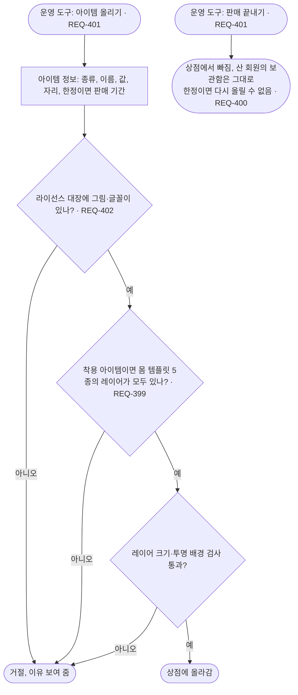

# FL-167 운영자가 아이템을 올리고 판매를 끝내기

Serves: REQ-399, REQ-400, REQ-401, REQ-402
Screens: 07 단계 뒤에 SCR를 채워요
Context: CTX-023

```mermaid
flowchart TD
  A(["운영 도구: 아이템 올리기 · REQ-401"]) --> B["아이템 정보: 종류, 이름, 값, 자리, 한정이면 판매 기간"]
  B --> C{"라이선스 대장에 그림·글꼴이 있나? · REQ-402"}
  C -->|"아니오"| X(["거절, 이유 보여 줌"])
  C -->|"예"| D{"착용 아이템이면 몸 템플릿 5종의 레이어가 모두 있나? · REQ-399"}
  D -->|"아니오"| X
  D -->|"예"| E{"레이어 크기·투명 배경 검사 통과?"}
  E -->|"아니오"| X
  E -->|"예"| G(["상점에 올라감"])
  H(["운영 도구: 판매 끝내기 · REQ-401"]) --> I(["상점에서 빠짐, 산 회원의 보관함은 그대로<br/>한정이면 다시 올릴 수 없음 · REQ-400"])
```
