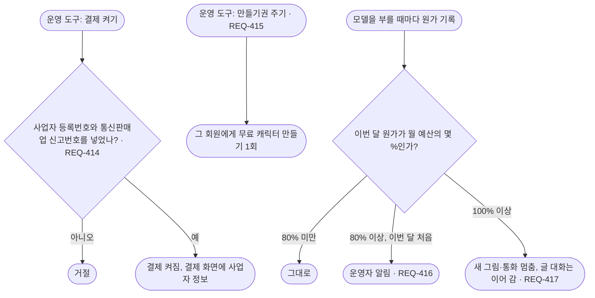

# FL-168 운영자가 결제를 켜고 원가 예산을 지키기

Serves: REQ-414, REQ-415, REQ-416, REQ-417
Screens: 없음(운영자가 서버 셸의 `tools/pet_admin.py`로 함)
Context: CTX-024

```mermaid
flowchart TD
  A(["운영 도구: 결제 켜기"]) --> B{"사업자 등록번호와 통신판매업 신고번호를 넣었나? · REQ-414"}
  B -->|"아니오"| X(["거절"])
  B -->|"예"| C(["결제 켜짐, 결제 화면에 사업자 정보"])
  D(["운영 도구: 만들기권 주기 · REQ-415"]) --> E(["그 회원에게 무료 캐릭터 만들기 1회"])
  F(["모델을 부를 때마다 원가 기록"]) --> G{"이번 달 원가가 월 예산의 몇 %인가?"}
  G -->|"80% 미만"| H(["그대로"])
  G -->|"80% 이상, 이번 달 처음"| I(["운영자 알림 · REQ-416"])
  G -->|"100% 이상"| J(["새 그림·통화 멈춤, 글 대화는 이어 감 · REQ-417"])
```
